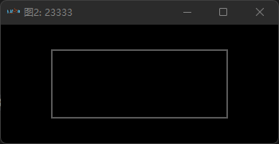

# monitor-tool-rs

使用纯 Rust 实现的跨平台二维数据可视化工具（[视频示例](https://www.bilibili.com/video/bv1Ei4y1X7SB)）。

- 实时、增量绘制简单二维图形（点、线段、圆）
- 跨平台
- 性能足够好
- 易用（颜色、点数等完全通过协议控制）
- 支持图形快照保存为文本文件

渲染基于 [iced](https://github.com/iced-rs/iced)。

## 使用说明

### 显示

产生数据的应用程序向工具启动时指定的固定端口发送 UDP 包即可实时绘图。

项目包含一个 [`[[bin]]`](src/bin/monitor-tool.rs) 目标用于启动应用程序。

不带参数默认以标题 `Figure1` 和端口 `12345` 启动。

```shell
cargo run --release
```

也可以传入指定的标题和端口。

```shell
cargo run --release -- 图2 23333
```



### 发送

数据源项目在 `Cargo.toml` 中依赖此项目。

```toml
monitor-tool = { path = "../monitor-tool-rs", default-features = false, features = [
    "client",
] }
```

调用编码器编码图形并发送（示例在[此文件](src/protocol/encoder.rs)末尾）。

```rust
  {
    let mut colors = Vec::with_capacity(256);
    for i in 0..255 {
        colors.push((i, rng.gen::<Srgba>()));
    }
    let _ = socket.send_to(
        &Encoder::with(|encoder| {
            encoder.config_topic("test", 200000, 200, &colors, |_| {});
        }),
        "127.0.0.1:12345",
    );
}

for i in 0 as u64.. {
    use std::{f32::consts::PI, thread};
    let mut encoder = Encoder::default();
    let mut test = encoder.topic("test");
    for j in 0..500 {
        let theta = ((i * 500 + j) as f32).powf(1.1) * PI * 1e-2;
        let (sin, cos) = theta.sin_cos();
        test.push(Vertex {
            x: 0.1 * theta * cos,
            y: 0.1 * theta * sin,
            _zero: 0,
            shape: Shape::Arrow,
            extra: f32::NAN,
            level: (i ^ j) as u8,
            alpha: 255,
        });
    }
    let _ = socket.send_to(&encoder.encode(), "127.0.0.1:12345");
    thread::sleep(Duration::from_millis(200));
}
```
